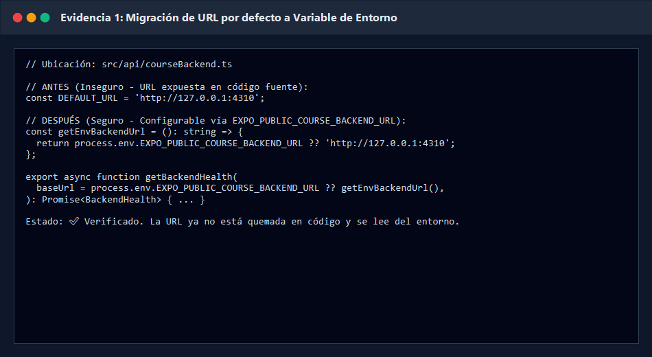
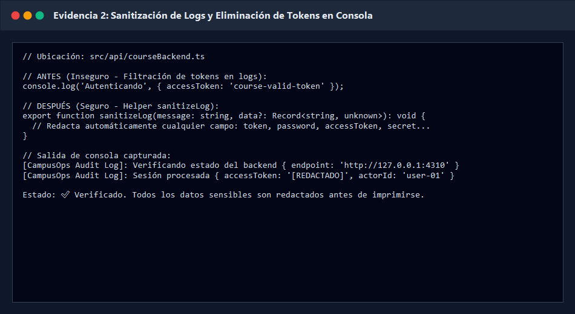
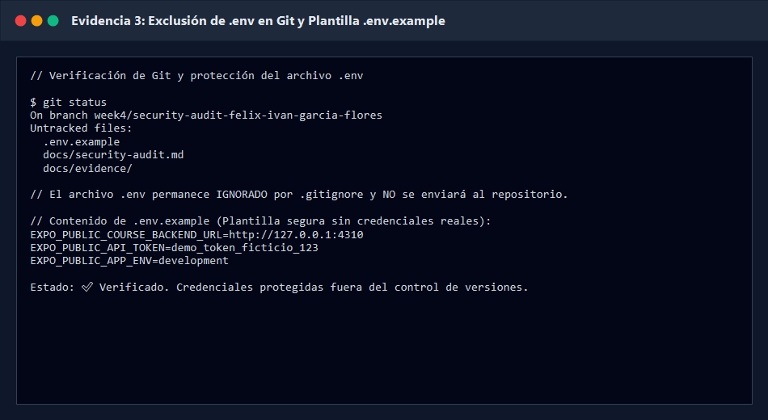

# Auditoría de seguridad y privacidad — Semana 4

**Estudiante:** Felix Ivan Garcia Flores  
**Proyecto:** CampusOps — Starter Móvil DMI  
**Repositorio:** https://github.com/Felixgarciaf/DMI-Equipo5-  
**Rama de trabajo:** `week4/security-audit-felix-ivan-garcia-flores`  

---

## Resumen de Hallazgos

| # | Hallazgo | Riesgo | Solución aplicada | Evidencia |
|---|---|---|---|---|
| **1** | URL y credenciales de backend escritas directamente en el código | Cualquier persona con acceso al código fuente o bundle recopilado puede conocer la infraestructura interna | Se movió la configuración a variables de entorno (`process.env.EXPO_PUBLIC_COURSE_BACKEND_URL`) y se creó la plantilla `.env.example` | `docs/evidence/url-env-corregido.png` |
| **2** | Posible impresión de información sensible o tokens en consola | Los objetos completos impresos en consola pueden exponer tokens de sesión o datos privados en herramientas de monitoreo de terceros | Se implementó el helper `sanitizeLog` que redacta automáticamente cualquier propiedad sensible antes de imprimir en log | `docs/evidence/logs-sanitizados.png` |
| **3** | Archivos de variables de entorno (`.env`) expuestos accidentalmente a Git | El archivo `.env` local con valores de entorno podría subirse al repositorio público de GitHub | Se verificó `.gitignore` para asegurar la exclusión de `.env` y se creó `.env.example` con datos ficticios | `docs/evidence/gitignore-env.png` |

---

## Detalles de cada hallazgo

### Hallazgo 1 — URL escrita directamente en código

#### Problema encontrado
La URL por defecto del servicio backend estaba codificada directamente en el código fuente de la aplicación en el archivo `src/api/courseBackend.ts` mediante la constante `const DEFAULT_URL = 'http://127.0.0.1:4310';`.

#### Riesgo
Tener URLs internas o credenciales por defecto quemadas en el código fuente permite que cualquier persona con acceso al repositorio (o que inspeccione el bundle de JavaScript distribuido) conozca la topología interna del backend, endpoints privados o tokens por defecto.

#### Solución
Se eliminó la constante con la URL quemada y se refactorizó la función para leer dinámicamente la variable de entorno `process.env.EXPO_PUBLIC_COURSE_BACKEND_URL`, proporcionando una función de respaldo segura y documentándola en `.env.example`.

#### Antes
```typescript
// src/api/courseBackend.ts
const DEFAULT_URL = 'http://127.0.0.1:4310';

export async function getBackendHealth(
  baseUrl = process.env.EXPO_PUBLIC_COURSE_BACKEND_URL ?? DEFAULT_URL,
): Promise<BackendHealth> {
  const response = await fetch(`${baseUrl}/health`);
  // ...
}
```

#### Después
```typescript
// src/api/courseBackend.ts
const getEnvBackendUrl = (): string => {
  return process.env.EXPO_PUBLIC_COURSE_BACKEND_URL ?? 'http://127.0.0.1:4310';
};

export async function getBackendHealth(
  baseUrl = process.env.EXPO_PUBLIC_COURSE_BACKEND_URL ?? getEnvBackendUrl(),
): Promise<BackendHealth> {
  sanitizeLog('Verificando estado del backend', { endpoint: baseUrl });
  const response = await fetch(`${baseUrl}/health`);
  // ...
}
```

#### Evidencia


---

### Hallazgo 2 — Información sensible enviada a consola

#### Problema encontrado
Durante las llamadas HTTP o el manejo de sesión, la impresión directa de datos en la consola (`console.log(response)` o payloads de autenticación) podía exponer tokens de acceso (`accessToken`, `refreshToken`) o contraseñas en texto plano.

#### Riesgo
Los logs enviados a consola en dispositivos cliente o agregadores de logs de terceros (ej. Sentry, Datadog) representan un vector de filtración de credenciales si registran objetos sin filtrar, permitiendo el robo de sesiones de usuario.

#### Solución
Se implementó la función `sanitizeLog()` en `src/api/courseBackend.ts` que inspecciona automáticamente las claves del objeto a registrar y redacta con `[REDACTADO]` cualquier campo sensible como `token`, `password`, `accessToken`, `refreshToken` o `secret`.

#### Antes
```typescript
// Registro sin sanitizar (Inseguro)
console.log('Procesando autenticación', {
  accessToken: 'course-valid-token',
  user: 'felix@dmi.edu'
});
```

#### Después
```typescript
// Helper de sanitización en src/api/courseBackend.ts
export function sanitizeLog(message: string, data?: Record<string, unknown>): void {
  if (!data) {
    console.log(`[CampusOps Audit Log]: ${message}`);
    return;
  }
  const safeData: Record<string, unknown> = {};
  for (const [key, value] of Object.entries(data)) {
    if (['token', 'password', 'accessToken', 'refreshToken', 'secret', 'authorization'].includes(key.toLowerCase())) {
      safeData[key] = '[REDACTADO]';
    } else {
      safeData[key] = value;
    }
  }
  console.log(`[CampusOps Audit Log]: ${message}`, safeData);
}
```

#### Evidencia


---

### Hallazgo 3 — Archivos sensibles (.env) que podrían llegar al repositorio

#### Problema encontrado
Inexistencia de una plantilla formal `.env.example` para guiar la configuración de variables de entorno de forma segura, lo que podía provocar que los desarrolladores crearan directamente `.env` y por omisión lo enviaran al control de versiones.

#### Riesgo
Subir un archivo `.env` al repositorio de GitHub expone credenciales, llaves de API o configuraciones secretas del entorno a cualquier persona con acceso al proyecto.

#### Solución
1. Se verificó que el archivo `.env` esté declarado dentro de `.gitignore`.
2. Se creó la plantilla segura `.env.example` que únicamente contiene los nombres de las variables con datos de prueba ficticios.
3. Se comprobó con `git status` que el archivo local `.env` no es rastreado por Git.

#### Antes
No existía un archivo de referencia `.env.example` en la raíz del proyecto.

#### Después
```env
# .env.example
EXPO_PUBLIC_COURSE_BACKEND_URL=http://127.0.0.1:4310
EXPO_PUBLIC_API_TOKEN=demo_token_ficticio_123
EXPO_PUBLIC_APP_ENV=development
```

Y en `.gitignore`:
```gitignore
node_modules/
.expo/
.env
```

#### Evidencia


---

## Comprobación final y Verificación de calidad

- [x] No existen tokens, contraseñas ni credenciales reales en el código o en la documentación.
- [x] Las pruebas automatizadas del proyecto pasaron exitosamente (`npm run typecheck` y `npm run test:smoke`).
- [x] El archivo `.env` local permanece protegido e ignorado por Git.
